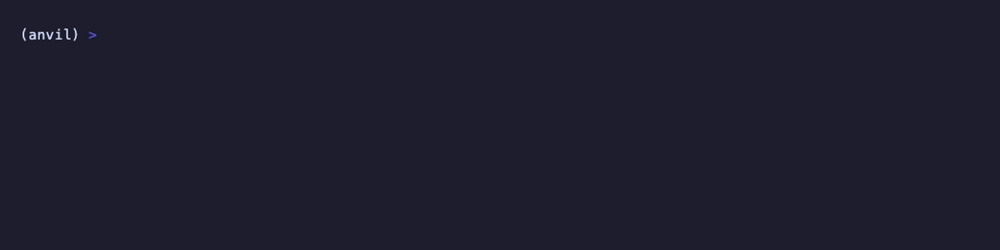

# anvil

**A self-improving-agent flywheel — an agent that reflects on its own eval
outcomes, remembers the lessons, and gets measurably better each iteration, in
~2k readable lines of Python.**



<sub>`anvil demo` teaching an agent to solve a six-task suite: the score climbs 0% → 100% as it learns. Recorded with [VHS](https://github.com/charmbracelet/vhs) (`vhs demo/anvil.tape`).</sub>

`anvil` is the seventh plane of a from-scratch agent platform. The other six
*run* an agent and *judge* it; `anvil` closes the loop so the agent improves
itself. It is not a framework and not a training pipeline: it is a tight, legible
implementation of the one thing that turns a static agent into a self-improving
one — a closed feedback loop where past outcomes automatically change future
behavior.

```
                 ┌───────────────────────────────────────────────────────┐
   task suite    │  cogs/ember RUN the agent → sonar OBSERVES the run →    │
      ───────────▶  gauntlet SCORES pass/fail → anvil REFLECTS on failures │
                 │                                                    │     │
                 └────────────────────────────────────────────────┐  ▼     │
   next iteration recalls lessons from loom-backed memory  ◀───────┘ loom   │
                 └───────────────────────────────────────────────────(store)┘
```

## The money shot

Run the built-in suite of six tasks — each rigged with a classic agent pitfall
(deleting without confirmation, guessing a config key, acting before searching,
reading a path it never listed, guessing instead of asking, writing without
reading current state). With empty memory the agent trips every one. Then watch
it teach itself ([animation above](#anvil)):

```
$ anvil demo

Self-improvement curve — tasks solved per iteration:

  iter 0  [························] 0/6  (  0%)   memory=2 (+2)   tokens=1800
  iter 1  [████████················] 2/6  ( 33%)   memory=4 (+2)   tokens=1800
  iter 2  [████████████████········] 4/6  ( 67%)   memory=6 (+2)   tokens=1950
  iter 3  [████████████████████████] 6/6  (100%)   memory=6 (+0)   tokens=2250

Δ pass rate: 0% → 100% over 4 iterations, driven by 6 learned lessons.
```

Nothing here is faked to look good: the world, the tools, and the grading are all
`gauntlet`'s real machinery. The only stand-in is the model itself (see
[Honesty](#honesty-what-is-and-is-not-simulated)).

## Why this exists / what it demonstrates

"Self-improving agent" is often hand-waved as "it has memory." Memory is one box
in the loop, not the loop. This repo makes the whole loop the point:

- **Reflection is grounded in real failure evidence.** A lesson is distilled from
  the tool-error strings the world returned and the reasons `gauntlet`'s graders
  gave — never from a hidden answer key. The agent improves because it read *why*
  it failed. (`anvil/reflect.py`)
- **Learning becomes behavior at one seam.** All improvement flows through a
  `ReflectiveProvider` that injects recalled lessons into the system prompt.
  Because that seam is the same `complete(system, messages, tools)` contract
  `gauntlet` and `cogs` both speak, the improved agent runs unchanged for real.
  (`anvil/provider.py`)
- **Improvement is measured, not assumed.** The score is the fitness function;
  the L3 optimizer keeps a prompt edit *only if* the eval goes up. Self-improving,
  not just self-changing.

## The loop, and the three levels of self-improvement

`anvil` implements one loop with progressively richer write-back:

| Level | What it learns | From | Module |
|---|---|---|---|
| **L1 — Reflection** | verbal lessons | failures | `reflect.py` + `memory.py` |
| **L2 — Skill library** | reusable tool procedures | successes | `skills.py` |
| **L3 — Prompt self-editing** | a better base prompt | eval score | `prompt.py` |

L1 is the flywheel `anvil demo` runs end to end. L2 and L3 are the same loop with
different artifacts, provided as composable components (with their own tests) and
wired through the same recall-and-inject seam.

## How it stands on the other six planes

`anvil` doesn't reimplement anything the platform already provides:

- **`loom`** *is* the memory — lessons are embedded, retrieved, and packed under a
  token budget by `loom` (pure-stdlib, offline).
- **`sonar`** meters every iteration — each run is ingested and costed.
- **`gauntlet`** is the environment and the judge — real tasks, real graders,
  real pass@k.
- **`cogs` / `ember` / `bulkhead`** are where the improved agent runs for real:
  the `ReflectiveProvider` is a drop-in for the same provider seam, so swapping
  the offline stub for a served, gateway-hardened model is a one-line change.

## Install & run

```bash
uv sync --extra dev      # installs anvil + editable loom/gauntlet/sonar + dev tools
uv run anvil demo        # print the curve
uv run anvil demo --html curve.html --iterations 6
uv run python examples/improve_demo.py
uv run pytest            # the whole suite runs offline, no credentials
```

## Honesty: what is and is not simulated

The loop is real; one component is a deterministic stand-in, clearly marked:

- **Real:** `gauntlet`'s simulated world, tool execution, error injection, and
  graders; `loom`'s embedding/retrieval/budgeting; `sonar`'s metering; the
  reflection logic that reads failure evidence; the whole control flow.
- **Simulated:** the model. `LearningStubProvider` is a deterministic offline
  stand-in that does what a real model does — reads the lessons in its context
  and acts better — but reproducibly, so the suite runs with zero credentials and
  the curve is byte-for-byte stable. Each scenario's improvement is unlocked by a
  cue token that genuinely appears in that task's failure evidence, so the lesson
  the reflector writes really is what flips behavior. Point the same
  `ReflectiveProvider` at `cogs.AnthropicProvider` and the identical loop drives a
  real Claude.

## Layout

```
anvil/
  loop.py         the flywheel: run → observe → score → reflect → store
  reflect.py      L1: distill a lesson from failure evidence
  memory.py       loom-backed lesson store (embed / recall / budget-pack)
  provider.py     ReflectiveProvider (the seam) + LearningStubProvider (offline model)
  skills.py       L2: distill reusable procedures from successes
  prompt.py       L3: adopt a prompt edit only if the eval score rises
  scenarios.py    six real gauntlet tasks, each with a classic pitfall
  report.py       the score-over-iterations curve (ASCII + HTML)
  cli.py          `anvil demo`
```

## License

MIT © 2026 Deepak
